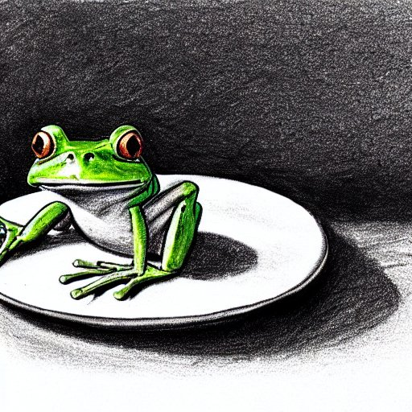

Imagine that you could start every day by eating a frog. Not a real frog, of course, but a metaphorical one: the most daunting and important task on your to-do list. That's the idea behind the book "Eat that frog!" by Brian Tracy, which I haven't read but was inspired by its catchy title. By eating your frog first thing in the morning, you can boost your productivity and confidence for the rest of the day. Nothing worse can happen to you after that!

How do you choose your frog? I like to sort my tasks by how much effort they require and how beneficial they are for me. The ones that are high-effort and high-benefit are my frogs: they are challenging but rewarding. For example, studying for a license or certificate that will advance my career. I'm an early bird, so I tackle these tasks before anything else. Then I move on to the medium-effort and medium-benefit tasks: the ones that I need to finish but don't excite me much. For example, doing some routine work or taking a course that is not very engaging. Finally, I save the low-effort and high-benefit tasks for last: the ones that I enjoy doing and don't drain my energy. For example, learning a new skill or technology that sparks my curiosity. Or it could be something simple and easy that makes me feel good after completing it.

The amazing thing about eating frogs is that sometimes they turn out to be delicious! Some tasks may seem scary or boring at first, but once you get started, you discover that they are actually fun and interesting. That happened to me when I studied for the AI-900 exam from Microsoft: I thought it would be just a necessary step to learn some basic services, but then I got hooked by the practical and fun lab work.

Of course, you don't want to eat the same frog every day: variety is important too! Eating frogs is a great way to form good habits, but there are many other things worth trying in life. For example, I used to exercise first thing in the morning as my frog, but once it became part of my routine, I switched it for another goal.

Some people may think that eating frogs is crazy or impossible: how can you do something so hard when you are not fully awake? But trust me: it works! It's like fasting every day (which I also do), except that you do eat something in the morning: your frogs!

[1] Prompt for my generated cover by [Stable Diffusion](https://stablediffusionweb.com/) `a frog in an espresso cup, in gray pencil simplistic drawing`

[2] Prompt for my generated image by Stable Diffusion `a frog on a plate, in gray pencil simplistic drawing`

<!-- Eat the frog the first thing in the morning and nothing worse can happen to you. I haven't read the whole book "Eat that frog!", but from the title itself, I applied the philosophy and my life changed in a good way.

I manage to organize my work/study day by the amount of effort I need to spend for a task.
For things I know that is beneficial for me but would take much of my energy to do, I prioritize them the first thing in the morning. Like license or certificate study. I am an early bird, so that's what I did. After that are the things with medium effort, but you need to finish. Like the work or the course you are not that motivated to do. The last part is the work that you are willing to do anyway. You don't need people pay you to do it. Maybe it's from your intrinsic motivation. Like learning a new framework/tech you are excited about. Or it could be small and easy task that will make you feel good after finishing it. Then you can call it a day.

Some interesting experience, some frogs are not that scary to eat once you drag yourself through a few hard days successfully. Some may look horrifying, but you may like them. For my case, it was the AI-900 from Microsoft. I started just to learn a necessary set of services, but the lab work really got me with the practical and fun tasks. So... you never know.

Remember to change your frog menu, this is good to get you into a habit, but there are many other things worth your try. I used to work out first thing in the morning, but once I got the habit, I used that for other goals.

I do fasting every day, but it turns out not to be true. I do eat in the morning, the frogs. -->